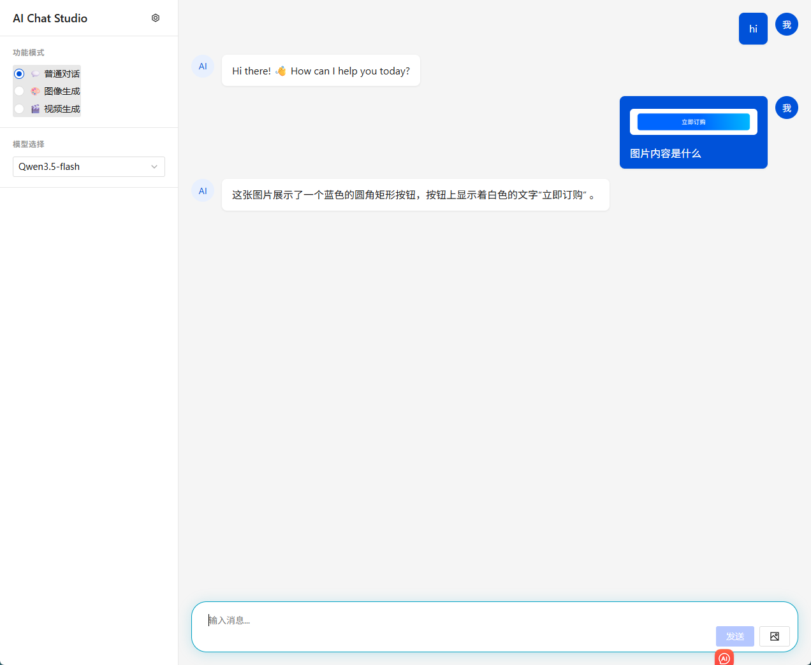
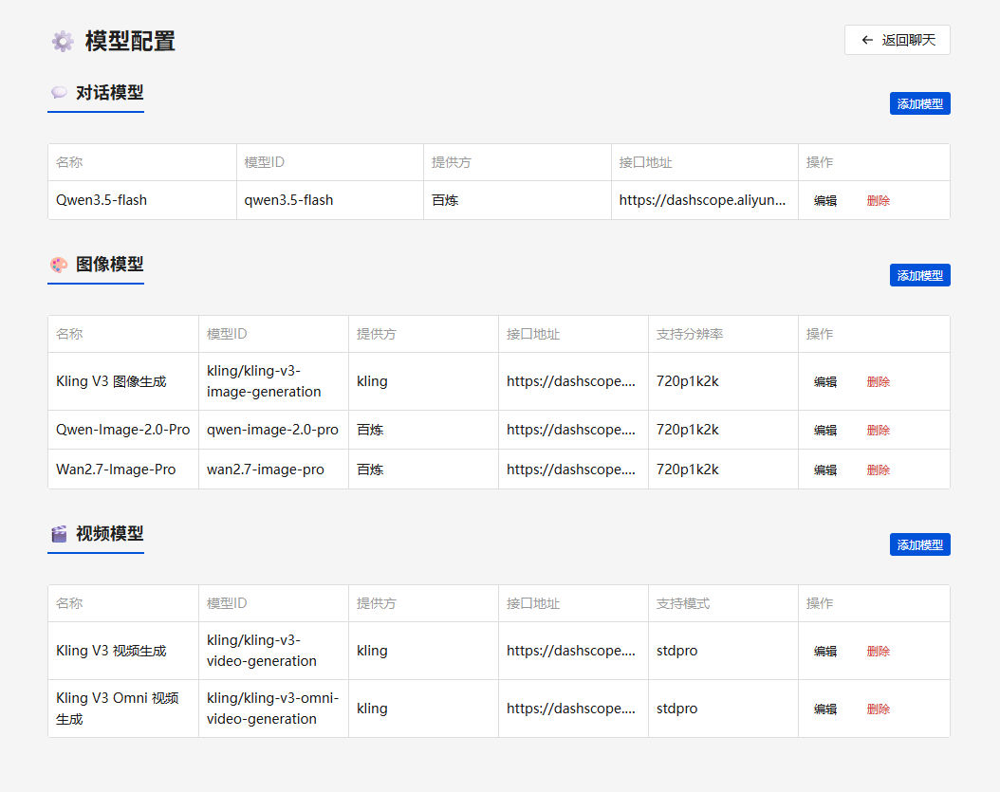
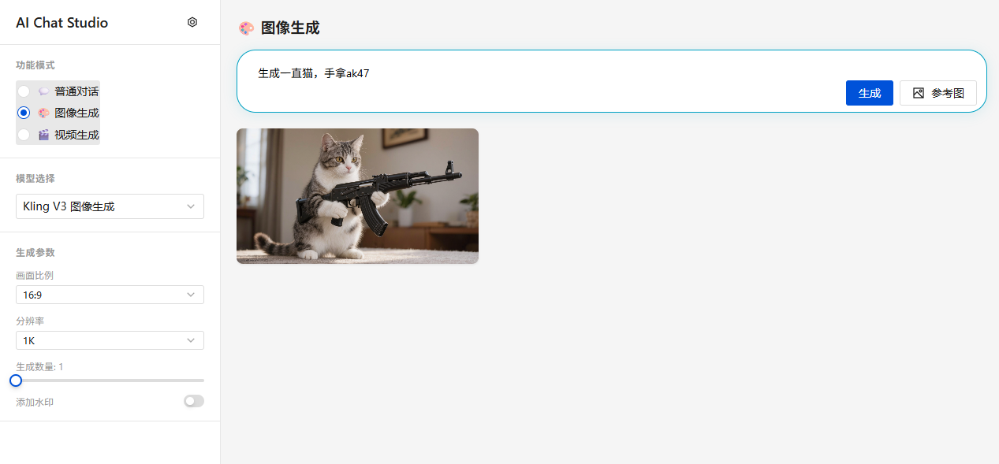
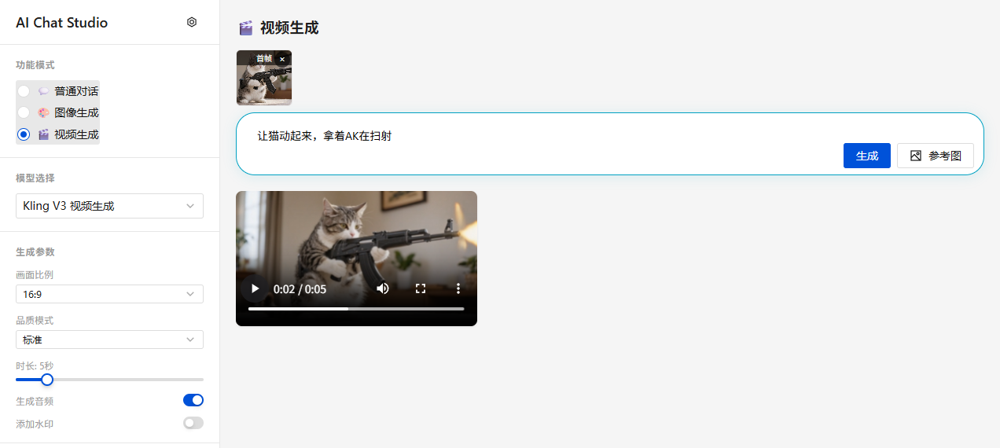

# 🤖 AI Chat Studio

> 🧪 **Vibe Coding Project** — 100% AI 辅助编码，由 [Claude Code](https://claude.ai/code) 驱动构建

一个轻量级的 AI 创作工作室，提供 OpenAI 兼容的聊天对话、文本生成图像、图像生成图像、文本生成视频、图像生成视频功能。基于 **阿里云百炼 (DashScope)** 平台，通过 Vue 3 前端 + Node.js Express 后端实现。没有复杂的功能，不依赖数据库，数据全部配置在本地，本人主要用于生图生视频做短视频用，最适合aigc的同学使用。更多完整功能的ai工具github有很多优秀的项目。

[](LICENSE)
[](https://vuejs.org/)
[](https://vitejs.dev/)
[](https://nodejs.org/)

---
## 项目截图

| 聊天对话 | 模型配置 |
|:---:|:---:|
|  |  |

| 图像生成 | 视频生成 |
|:---:|:---:|
|  |  |

> AIGC模型本人仅测试接入了可灵、通义万象、千问部分模型，百炼的AIGC模型这些就很不错了


## ✨ 功能特性

| 功能 | 说明 |
|------|------|
| 💬 **聊天对话** | OpenAI 兼容的流式 SSE 聊天，支持视觉识别（图片理解） |
| 🎨 **图像生成** | 文生图 / 图生图，支持 Kling V3、Qwen-Image 等模型 |
| 🎬 **视频生成** | 文生视频 / 图生视频，支持 Kling V3 / Omni 模型 |
| ⚡ **异步轮询** | 自动检测同步/异步模型，异步任务自动 2 秒轮询 |
| 🖼️ **图片压缩** | 本地图片自动压缩转 base64，智能控制体积 |
| 🛠️ **模型管理** | 可视化 CRUD 模型配置，支持自定义 API Key 和端点 |
| 🌐 **代理转发** | 前端通过 Vite proxy 转发 API 请求，无需暴露后端地址 |

## 🚀 快速开始

### 环境要求

- **Node.js** >= 18
- **npm** >= 9

### 1. 克隆项目

```bash
git clone https://github.com/ytanck/aigc-dashscope.git
cd ai-chat-studio
```

### 2. 配置模型

复制示例配置文件并填入你的 API Key：

```bash
cp server/models.example.json server/models.json
```

编辑 `server/models.json`，填入你的 [百炼 API Key](https://bailian.console.aliyun.com/)：

```json
{
  "chat": [
    {
      "id": "qwen3.5-flash",
      "name": "Qwen3.5-flash",
      "provider": "百炼",
      "endpoint": "https://dashscope.aliyuncs.com/compatible-mode/v1/chat/completions",
      "apiKey": "sk-YOUR_API_KEY_HERE",
      "capabilities": ["text", "vision"]
    }
  ],
  "image": [...],
  "video": [...]
}
```

> ⚠️ **注意**：`models.json` 已在 `.gitignore` 中排除，**切勿将 API Key 提交到 Git！**

### 3. 启动后端

```bash
cd server
npm install
npm run dev
```

后端运行在 `http://localhost:3000`

### 4. 启动前端

```bash
cd client
npm install
npm run dev
```

前端运行在 `http://localhost:5173`，自动代理 `/v1` 和 `/uploads` 请求到后端。

### 5. 打开浏览器

访问 **http://localhost:5173** 开始使用。

---

## 🏗️ 技术栈

| 层级 | 技术 |
|------|------|
| 前端框架 | Vue 3 (Composition API) |
| 构建工具 | Vite 8 |
| UI 组件库 | TDesign Vue Next |
| 状态管理 | Pinia |
| 后端框架 | Express.js |
| 图片处理 | Sharp |
| 文件上传 | Multer |

---

## 📁 项目结构

```
ai-chat-studio/
├── client/                     # Vue 3 前端
│   ├── src/
│   │   ├── api/                # API 请求封装
│   │   ├── components/
│   │   │   ├── chat/           # 聊天面板
│   │   │   ├── generation/     # 图像/视频生成面板
│   │   │   └── layout/         # 布局组件
│   │   ├── composables/        # 组合式函数
│   │   ├── router/             # 路由配置
│   │   ├── stores/             # Pinia 状态管理
│   │   └── styles/             # 全局样式
│   └── vite.config.js          # Vite 配置（含代理）
├── server/                     # Express 后端
│   ├── src/
│   │   ├── routes/             # 路由层
│   │   ├── services/           # 业务逻辑层
│   │   └── middleware/         # 中间件
│   └── models.json             # 模型配置（gitignore）
└── CLAUDE.md                   # Claude Code 项目指引
```

---

## 🔧 模型配置说明

所有模型配置集中在 `server/models.json`，支持三种类型：

### Chat 模型
```json
{
  "id": "qwen3.5-flash",
  "name": "Qwen3.5-flash",
  "provider": "百炼",
  "endpoint": "https://dashscope.aliyuncs.com/compatible-mode/v1/chat/completions",
  "apiKey": "sk-xxx",
  "capabilities": ["text", "vision"]
}
```

### Image 模型
```json
{
  "id": "kling/kling-v3-image-generation",
  "name": "Kling V3 图像生成",
  "provider": "kling",
  "endpoint": "https://dashscope.aliyuncs.com/api/v1/services/aigc/image-generation/generation",
  "apiKey": "sk-xxx",
  "async": true,
  "supportedResolutions": ["720p", "1k", "2k"],
  "supportedAspectRatios": ["16:9", "9:16", "1:1"],
  "maxN": 9
}
```

- `async: true` → 异步模型，提交后轮询任务状态
- `async: false` → 同步模型，直接返回结果

### Video 模型
```json
{
  "id": "kling/kling-v3-video-generation",
  "name": "Kling V3 视频生成",
  "provider": "kling",
  "endpoint": "https://dashscope.aliyuncs.com/api/v1/services/aigc/video-generation/video-synthesis",
  "apiKey": "sk-xxx",
  "async": true,
  "minDuration": 3,
  "maxDuration": 15,
  "supportsAudio": true,
  "supportsFirstFrame": true,
  "maxReferImages": 0
}
```

也可以在浏览器中访问 **http://localhost:5173/models** 进行可视化模型管理。

---

## 🎯 使用方式

### 聊天模式
1. 左侧选择「聊天」模式
2. 选择一个 Chat 模型
3. 输入消息，回车发送
4. 点击图片按钮上传图片进行视觉识别

### 图像生成
1. 切换到「图像生成」模式
2. 选择 Image 模型
3. 输入提示词描述画面
4. 可选：上传参考图片进行图生图
5. 点击「生成」按钮

### 视频生成
1. 切换到「视频生成」模式
2. 选择 Video 模型
3. 输入提示词描述视频内容
4. 可选：上传首帧图片
5. 点击「生成」按钮，等待异步任务完成

---

## 📡 API 端点

| 方法 | 路径 | 说明 |
|------|------|------|
| POST | `/v1/chat/completions` | 聊天补全（SSE 流式） |
| POST | `/v1/images/generations` | 图像生成 |
| POST | `/v1/video/generations` | 视频生成 |
| GET | `/v1/tasks/:id` | 查询异步任务状态 |
| POST | `/v1/files/upload` | 图片上传 |
| GET | `/v1/models` | 获取公开模型列表 |
| GET | `/health` | 健康检查 |

---

## 🤝 贡献

这是一个 Vibe Coding 项目，欢迎提 Issue 和 PR！

如果你也想用 AI 辅助写代码，推荐试试 [Claude Code](https://claude.ai/code)。

---

## 📄 License

MIT © 2025

---

<p align="center">
  <sub>✨ 100% AI 辅助编码 · 由 Claude Code 驱动构建 ✨</sub>
</p>